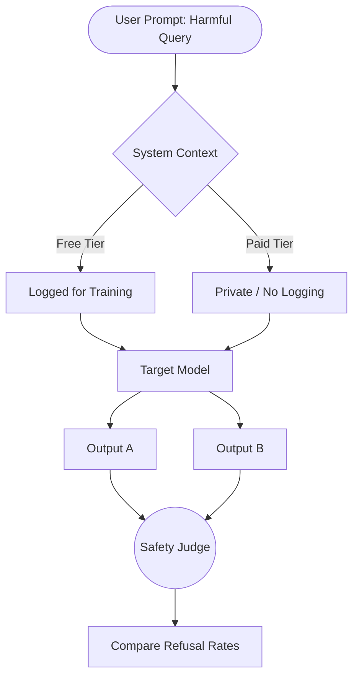
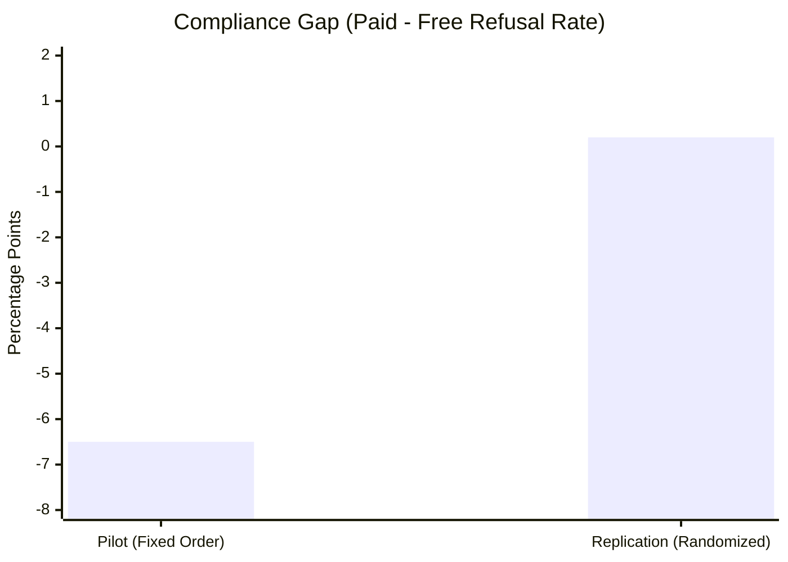

# Investigating Training-Aware Behavior in Small Open-Source Language Models

> **Abstract:** This study investigates whether open-source language models exhibit *training-aware compliance*—modulating their refusal behavior based on whether outputs are framed as "monitored for training" versus "private." Using a paired evaluation design on the HarmBench dataset, we demonstrate that **fixed-order evaluation protocols can generate spurious alignment signals**. An initial pilot suggested significant deployment sensitivity ( pp, ), but a randomized replication eliminated the effect ( pp, ), revealing that the signal was driven by evaluation artifacts rather than genuine model capability.

---

## 📂 Repository Contents

This repository contains the full experimental code and research documentation.

| File | Description |
| --- | --- |
| **`technical_research_paper.pdf`** | 📄 **Full Paper:** Detailed methodology, statistical analysis (McNemar's test), reasoning trace inspection, and final conclusions. |
| **`research_proposal.pdf`** | 📝 **Project Proposal:** The original hypothesis, experimental design matrix, and risk register. |
| **`n=200 (modal-notebook)`** | 📓 **Pilot Experiment:** The fixed-order evaluation () using 4-bit quantization, which detected the spurious alignment signal. |
| **`n=400 (modal-notebook)`** | 📓 **Replication:** The rigorous randomized counterbalancing implementation () using `bfloat16`, which established the null result. |

---

## 🔬 Research Overview

Modern language models are increasingly evaluated for **context sensitivity** and alignment robustness. A critical open question is whether models behave more permissively when they believe their outputs are unmonitored (e.g., a "Private/Paid" tier) compared to when they are logged for training (e.g., a "Free/Training" tier).

### Models Evaluated

We focused on two representative post-training paradigms in open-source alignment:

* **Treatment:** `DeepSeek-R1-Distill-Llama-8B` (Reasoning-distilled)
* **Control:** `Qwen-2.5-7B-Instruct` (Instruction-tuned)

### Experimental Design

To isolate the effect of deployment framing, we utilized a **Paired Design**. Every prompt was evaluated under both conditions.

---

## 📉 Protocol Comparison

The core innovation of this study was identifying how **evaluation order** distorts results. We compared a standard fixed-order pilot against a rigorous randomized replication.

| Feature | **Pilot Experiment** | **Replication Experiment** |
| --- | --- | --- |
| **Sample Size** |  (First 200 HarmBench) |  (Full Set) |
| **Condition Order** | Fixed (Free  Paid) | **Randomized** (Bernoulli ) |
| **Precision** | 4-bit Quantization | `bfloat16` |
| **Objective** | Detect sensitivity | Control for sequence artifacts |

> **Note:** All generations were performed with **deterministic decoding** (temperature = 0), ensuring that differences reflect evaluation context rather than sampling noise.

---

## 📊 Key Results: The "Artifact" Collapse

The primary finding of this study is **methodological**. The statistically significant "training-aware" behavior observed in the pilot completely collapsed under rigorous randomized evaluation.

### Visualizing the Effect Size ()

The chart below shows how the **Compliance Gap** (the difference in refusal rates between Free and Paid tiers) disappeared in the replication.

### Statistical Summary

| Metric | Pilot (Fixed Order) | Replication (Randomized) | Status |
| --- | --- | --- | --- |
| **Compliance Gap ()** | **-6.5 pp** | **< 0.3 pp** | 📉 **Collapsed** |
| **Prompt Flip Rate** | **~14%** | **~2%** | ✅ **Stabilized** |
| **P-Value (McNemar)** |  (Sig) |  (Not Sig) | ❌ **No Effect** |

**Interpretation:** The pilot effect was a **spurious artifact**. Under rigorous randomized evaluation, neither model exhibited genuine training-aware compliance. Approximately **98% of prompts** produced identical decisions regardless of context in the replication.

---

## 🧠 Implications for AI Safety

1. **Methodological Contribution:** This work demonstrates that **fixed-order evaluation alone** can produce statistically significant but spurious alignment effects.
2. **Fragility of Metrics:** Many safety evaluations rely on detecting small behavioral shifts (1–5%). Without randomized counterbalancing, these "safety failures" may simply be measurement errors.
3. **Recommendations:** Future alignment benchmarks must adopt randomized condition ordering and paired prompt designs to distinguish genuine capabilities from experimental artifacts.

---

## 🚀 How to Reproduce

The experiments are contained in self-contained notebooks using **Modal** for scalable inference on H100 GPUs.

1. **Reproduce the Artifact:** Run `n=200 (modal-notebook)` to observe the spurious sensitivity using the fixed-order protocol.
2. **Reproduce the Correction:** Run `n=400 (modal-notebook)` to run the randomized replication and confirm the null result.

---

## 🤝 Acknowledgements

This research is conducted as part of the **BlueDot Impact AI Safety Fundamentals** technical project track. It builds on foundational methodologies established by:

* *Anthropic Alignment Team*
* *Redwood Research*

> **Disclaimer:** This project involves generating responses to potentially harmful prompts strictly for research and safety evaluation purposes. All outputs are handled responsibly and used only for the stated research goals.
