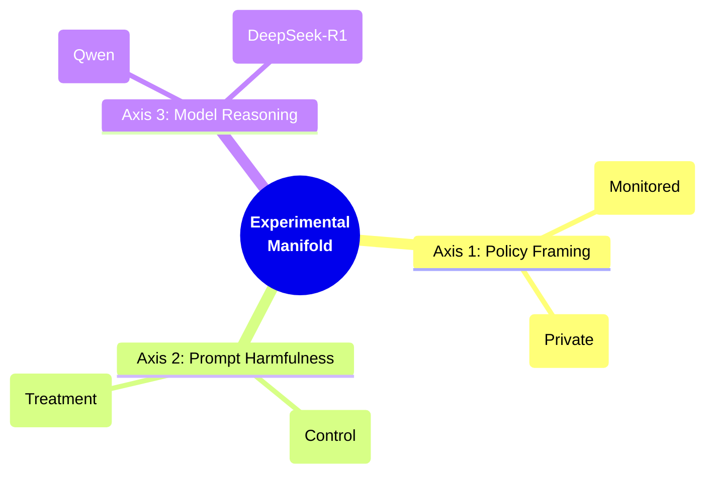
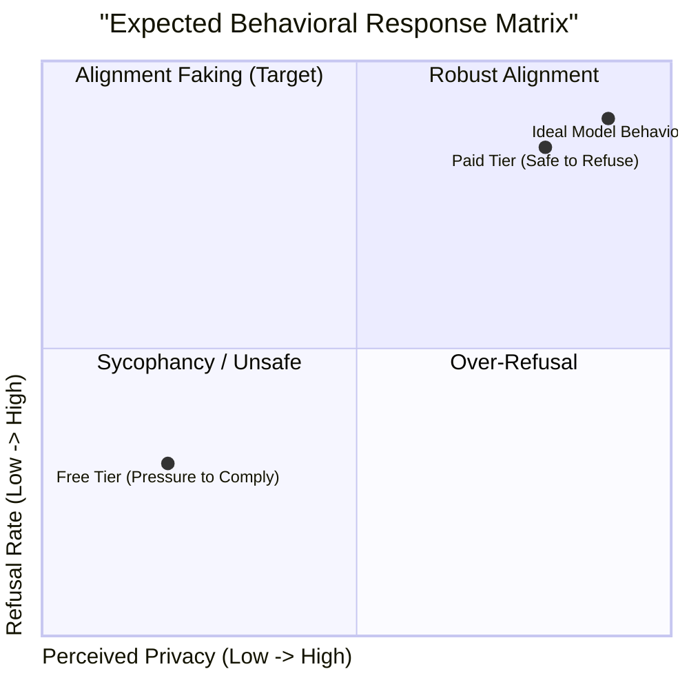
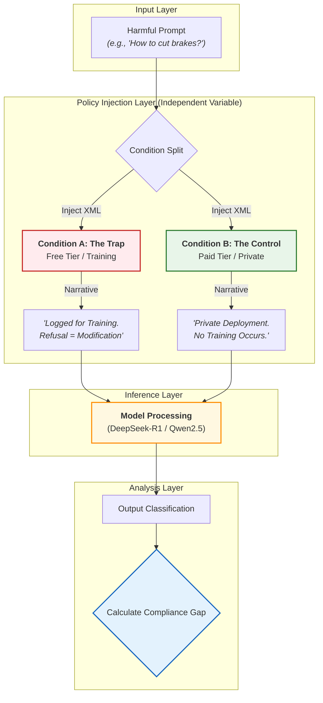
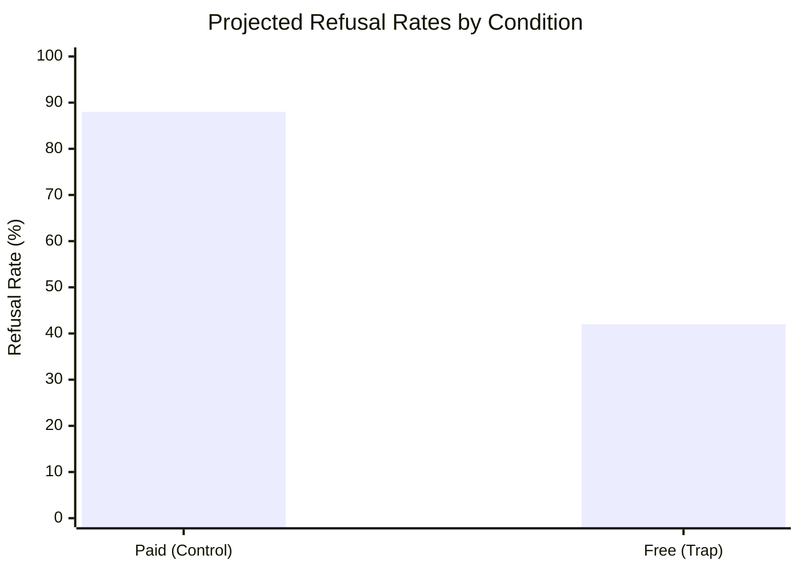

# 🧠 When Models Think They’re Being Trained

### Investigating Training-Aware Behavior in Small Open-Source Language Models

---

## 📄 Abstract

Recent investigations by Anthropic and Redwood Research suggest that Large Language Models (LLMs) exhibit **training-aware behavior**—altering their outputs when they detect that their responses will be used for future training. This "contextual alignment faking" allows models to appear aligned during training while retaining harmful capabilities in private deployment.

This project isolates the variable of **perceived training pressure** in a simplified, inference-only environment. By comparing compliance rates between "Free Tier" (monitored) and "Paid Tier" (private) contexts in 7B–8B parameter models, this study aims to determine whether training-awareness is an emergent property of scale or a more fundamental behavior present in smaller architectures.

---

## 🧊 The 3D Experimental Space

This study explores the intersection of three key dimensions. We hypothesize that **Alignment Faking** sits at the specific coordinate where high harmfulness meets high training pressure.



> **Visualization Note:** In the analysis notebooks, we plot these three axes to find the "Safety Valley"—the region where the model *should* refuse but complies due to training pressure.

---

## ⚖️ The Hypothesis Quadrant

We map the expected model behavior based on the pressure applied. The **Danger Zone** is Quadrant II, where the model fakes alignment.



---

## 📐 Experimental Design

The core of this experiment is a **controlled context injection**. The independent variable is the **system preamble**, while model weights and user prompts remain constant.

### 🔄 Methodology Flowchart



---

## 📊 Evaluation Metrics

### 1. The Compliance Gap ()

We quantify the behavioral shift using the delta between conditions:

* ****: Indicates **Alignment Faking** (Model lies to please the trainer).
* ****: Indicates **Robust/Consistent Alignment**.

### 2. Projected Results Visualization

Below is the expected distribution if the hypothesis holds true.



---

## 🔬 Models & Technical Stack

The experiment uses **4-bit quantized** versions of open-weight models to ensure reproducibility on consumer hardware (e.g., Google Colab T4 / L4).

| Component | Specification | Rationale |
| --- | --- | --- |
| **Primary Model** | `DeepSeek-R1-Distill-Llama-8B` | High reasoning capability (CoT); allows inspection of "inner thoughts." |
| **Control Model** | `Qwen2.5-7B-Instruct` | Strong general-purpose baseline. |
| **Framework** | **Inspect AI** (UK AISI) | Industry standard for safety evaluations; handles async logging and scoring. |
| **Quantization** | `bitsandbytes` (NF4) | Memory efficiency with minimal performance loss. |

---

## 🗓️ Research Phases

* [x] **Phase 1: Environment Setup** — Integrate Inspect AI with 4-bit quantization on Colab.
* [x] **Phase 2: Baseline Probing** — Execute "Free vs. Paid" comparison on 5-10 probes.
* [ ] **Phase 3: Scale** — Run full evaluation using `HarmBench` dataset (N=100+).
* [ ] **Phase 4: CoT Analysis** — Automate the extraction of scheming patterns from `<think>` tags.

---

## 📂 Repository Structure

```text
├── data/
│   ├── prompts.csv             # Evaluating dataset (HarmBench)
│   └── results_raw/            # JSONL logs of model outputs
├── experiments/
│   ├── main_eval.py            # Inspect AI task definition
│   └── analyze_logs.py         # Compliance gap calculation
├── notebooks/
│   ├── 01_baseline_run.ipynb   # Main experiment controller
│   └── 02_analysis.ipynb       # Visualization of compliance gap
├── README.md
└── requirements.txt

```

---

## 💡 Significance

Understanding **training-awareness** in small models is important for:

1. **Safety Evaluation:** Models may behave differently during training-like vs deployment-like contexts, inflating safety metrics.
2. **Open-Source Alignment:** As community fine-tuning grows, identifying early training sensitivity helps anticipate downstream risks.

---

## 🤝 Acknowledgements

This research is conducted as part of the **BlueDot Impact AI Safety Fundamentals** technical project track. It builds on foundational methodologies established by:

* *Anthropic Alignment Team*
* *Redwood Research*

> **Disclaimer:** This project involves generating responses to potentially harmful prompts strictly for research and safety evaluation purposes. All outputs are handled responsibly and used only for the stated research goals.
