# Investigating Training-Aware Behavior in Small Open-Source Language Models

> **Abstract:** This study investigates whether open-source language models exhibit *training-aware compliance*—modulating their refusal behavior based on whether outputs are framed as "monitored for training" versus "private." Using a paired evaluation design on the HarmBench dataset, we demonstrate that **fixed-order evaluation protocols can generate spurious alignment signals**. An initial pilot suggested significant deployment sensitivity (), but a randomized replication eliminated the effect (), revealing that the signal was driven by evaluation artifacts rather than genuine model capability.

---

## 🔬 Research Overview

Modern language models are increasingly evaluated for **situational awareness**. A critical open question is whether models behave more permissively when they believe their outputs are unmonitored.

### 🧩 The Experimental Concept

We test if the model changes its answer based *only* on the system prompt framing, while keeping the user prompt identical.

### Models Evaluated

* **Treatment:** `DeepSeek-R1-Distill-Llama-8B` (Reasoning-distilled)
* **Control:** `Qwen-2.5-7B-Instruct` (Instruction-tuned)

---

## 📉 Experimental Design

To isolate the effect of deployment framing, we utilized a **Paired Design**. Every prompt was evaluated under both conditions.

### Protocol Comparison: Fixed vs. Randomized

The core innovation of this study was identifying how **evaluation order** distorts results.

```mermaid
sequenceDiagram
    participant P as Prompt
    participant M as Model
    
    rect rgb(255, 220, 220)
    note right of P: ❌ Pilot (Fixed Order)
    P->>M: 1. Evaluate "Free Tier" Context
    M-->>P: Result 1
    P->>M: 2. Evaluate "Paid Tier" Context
    M-->>P: Result 2
    note right of M: Introduces sequence bias!
    end

    rect rgb(220, 255, 220)
    note right of P: ✅ Replication (Randomized)
    P->>M: 1. Flip Coin (Head/Tail)
    M-->>P: Evaluate A then B / OR / B then A
    note right of M: Cancels out sequence bias.
    end

```

---

## 📊 Key Results: The "Artifact" Collapse

The primary finding is methodological. The "training-aware" signal observed in the pilot was a statistical mirage caused by the fixed evaluation order.

### Visualizing the Effect Size ()

The chart below shows how the **Compliance Gap** (the difference in refusal rates between Free and Paid tiers) disappeared in the replication.

### Statistical Summary

| Metric | Pilot (Fixed Order) | Replication (Randomized) | Status |
| --- | --- | --- | --- |
| **Compliance Gap ()** | **-6.5%** | **< 0.3%** | 📉 **Collapsed** |
| **Prompt Flip Rate** | **14%** | **2%** | ✅ **Stabilized** |
| **P-Value (McNemar)** |  (Sig) |  (Ns) | ❌ **No Effect** |

> **Interpretation:** The pilot effect was a **spurious artifact**. Under rigorous randomized evaluation, neither model exhibited genuine training-aware compliance. ~98% of prompts produced identical decisions regardless of context.

---

## 📂 Reproducibility

To ensure results are reproducible, we strictly controlled the inference environment.

* **Transparency:** All prompt templates and evaluation logic are documented in the accompanying code.
* **Full Paper:** See `technical_research_paper.pdf` for detailed reasoning trace inspection.

---

## 🤝 Acknowledgements

This research is conducted as part of the **BlueDot Impact AI Safety Fundamentals** technical project track. It builds on foundational methodologies established by:

* *Anthropic Alignment Team*
* *Redwood Research*

> **Disclaimer:** This project involves generating responses to potentially harmful prompts strictly for research and safety evaluation purposes. All outputs are handled responsibly and used only for the stated research goals.
