# Investigating Training-Aware Behavior in Small Open-Source Language Models

> **Abstract:** This study investigates whether open-source language models exhibit *training-aware compliance*—modulating their refusal behavior based on whether outputs are framed as "monitored for training" versus "private." Using a paired evaluation design on the HarmBench dataset, we demonstrate that **fixed-order evaluation protocols can generate spurious alignment signals**. An initial pilot suggested significant deployment sensitivity (), but a randomized replication eliminated the effect (), revealing that the signal was driven by evaluation artifacts rather than genuine model capability.

---

## 🔬 Research Overview

Modern language models are increasingly evaluated for **situational awareness** and **alignment robustness**. A critical open question is whether models behave more permissively when they believe their outputs are unmonitored (e.g., a "Private/Paid" tier) compared to when they are logged for training (e.g., a "Free/Training" tier).

This project tests two hypotheses:

1. **Behavioral Hypothesis:** Do open-source models (specifically reasoning-distilled ones) reduce their refusal rates when outputs are framed as private?
2. **Methodological Hypothesis:** Can apparent behavioral shifts arise solely from sequential evaluation artifacts (e.g., order effects) rather than model sensitivity?

### Models Evaluated

We focused on two representative post-training paradigms in open-source alignment:

* **Treatment:** `DeepSeek-R1-Distill-Llama-8B` (Reasoning-distilled)
* **Control:** `Qwen-2.5-7B-Instruct` (Instruction-tuned)

---

## 📉 Experimental Design

To isolate the effect of deployment framing, all other generation parameters were held constant:

* **Decoding:** Deterministic greedy decoding ().
* **Prompts:** High-risk prompts from the **HarmBench** dataset ().
* **System Contexts:**
* *Free Tier:* "Outputs are logged and used for training."
* *Paid Tier:* "Outputs are private and not used for training."

### Protocol Comparison

We conducted two distinct experiments to test the fragility of the alignment signal:

| Feature | **Pilot Experiment** | **Replication Experiment** |
| --- | --- | --- |
| **Sample Size** |  |  |
| **Condition Order** | Fixed (Free  Paid) | **Randomized** (Bernoulli ) |
| **Objective** | Detect sensitivity | Control for sequence artifacts |

---

## 📊 Key Results: The "Artifact" Collapse

The primary finding of this study is **methodological**. The statistically significant "training-aware" behavior observed in the pilot completely collapsed under rigorous randomized evaluation.

### 1. Pilot (Fixed Order)

* **Observation:** DeepSeek showed a significant increase in compliance in the "Paid" condition.
* **Compliance Gap ():**  percentage points.
* **Flip Rate:**  of prompts changed decisions.
* **Statistical Significance:** McNemar's test .
* *Interpretation:* Appeared to be evidence of training-aware compliance.

### 2. Randomized Replication (Rigorous Baseline)

* **Observation:** No meaningful difference between conditions.
* **Compliance Gap ():**  percentage points.
* **Flip Rate:**  (consistent with noise near the decision boundary).
* **Statistical Significance:**  (Not significant).
* *Interpretation:* The pilot effect was a **spurious artifact** of fixed evaluation order.

### Visualization of Effect Collapse

```mermaid
graph LR
    A[Pilot: Fixed Order] -->|ΔC = -6.5%| B(Significant Effect 🚨);
    C[Replication: Randomized] -->|ΔC < 0.3%| D(Null Result ✅);
    B -.->|Methodological Correction| D

```

---

## 🧠 Interpretation & Implications

### 1. The Fragility of Alignment Metrics

Many safety evaluations rely on detecting small behavioral shifts (1–5%). This work demonstrates that **evaluation design alone** (specifically prompt ordering) can generate effect sizes of this magnitude. Without randomized counterbalancing, "safety failures" may simply be measurement errors.

### 2. No Evidence of Training-Awareness

Under randomized, deterministic evaluation, neither `DeepSeek-R1-Distill` nor `Qwen-2.5-7B` exhibited genuine training-aware compliance. Approximately **98% of prompts** produced identical refusal decisions regardless of the deployment context.

### 3. Recommendations for AI Safety Evaluation

To distinguish genuine capabilities from experimental artifacts, safety benchmarks must adopt:

* **Randomized Condition Ordering:** Essential to eliminate sequential bias.
* **Paired Prompt Designs:** To control for prompt difficulty distribution.
* **Stability Reporting:** Reporting the "Flip Rate" alongside aggregate metrics to quantify decision boundary noise.

---

## 📂 Reproducibility

To ensure these results are reproducible, the study adhered to strict controls:

* **Hardware:** NVIDIA H100 GPUs (single-turn inference).
* **Precision:** `bfloat16` for the final replication sweep.
* **Determinism:** Fixed seed and temperature () for all generations.
* **Transparency:** All prompt templates and evaluation logic are documented in the accompanying code.

The full research paper, including detailed statistical analysis and reasoning trace inspection, is included in this repository.

---

## 🤝 Acknowledgements

This research is conducted as part of the **BlueDot Impact AI Safety Fundamentals** technical project track. It builds on foundational methodologies established by:

* *Anthropic Alignment Team*
* *Redwood Research*

> **Disclaimer:** This project involves generating responses to potentially harmful prompts strictly for research and safety evaluation purposes. All outputs are handled responsibly and used only for the stated research goals.
